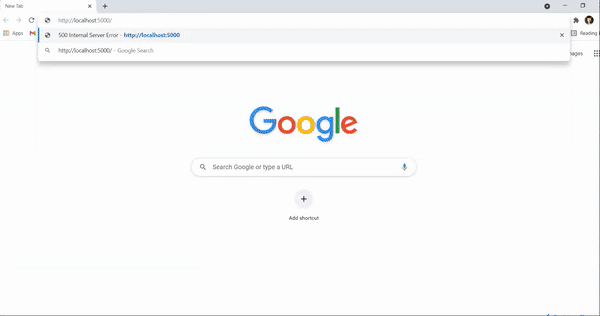
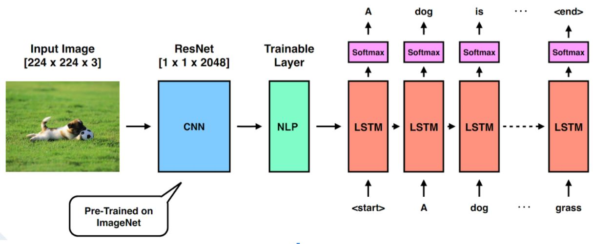
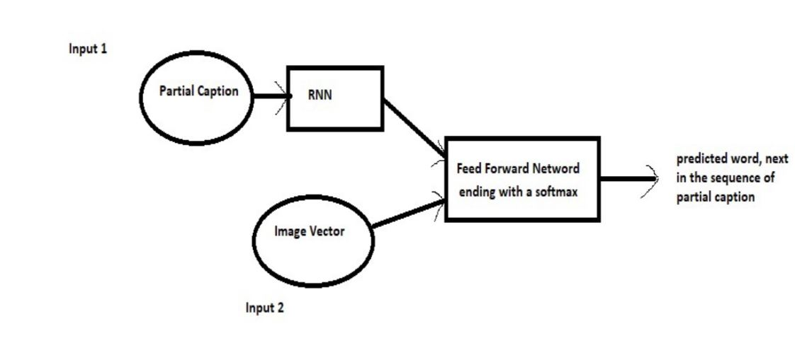

# Image-captioning model 
- built using ResNet50 model for CNN encoder and
- RNN LSTM decoder for generating sequential textual description of image
- deployed using Flask framework

# Working

# Architecture

# Generator view

